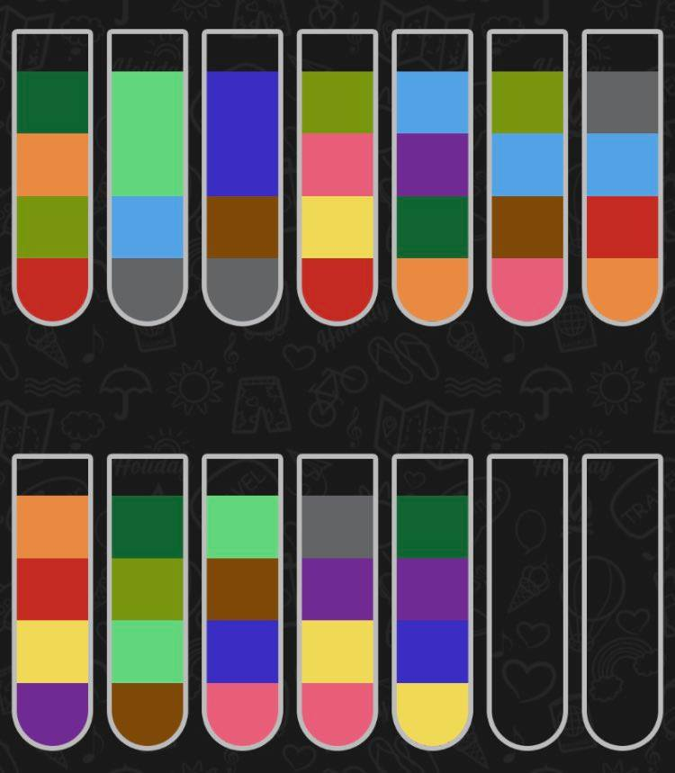

# WaterPuzzleSort

This game is about to solve the water puzzle sort problem, but it's so diffcult to solve after 100
level, so I write the code to detect screenshot and it will auto generate solution to you.

Have fun^^



# How to use
First save the screen shot under the folder and name it to `img.jpg`.  
After that you just need run the `utils.py` and it will give you the puzzle like this
```
1 1
2 1
3 1
4 1
5 1
6 1
7 2
5 1
8 1
9 2
1 1
10 1
11 1
2 1
3 1
4 1
12 1
6 1
11 1
8 1
6 1
2 1
3 1
1 1
6 1
5 1
12 1
10 1
1 1
3 1
8 1
7 1
2 1
4 1
11 1
9 1
8 1
7 1
11 1
10 1
12 1
5 1
10 1
9 1
12 1
4 1
```

And then input this to the `./sol`, finally it will give you solution just like this.
```
1 13
1 14
4 1
6 1
5 6
8 14
9 13
1 9
12 13
5 12
5 13
5 14
2 5
6 2
9 1
10 5
1 9
6 10
6 4
2 6
7 2
6 7
7 6
7 8
7 14
1 7
8 1
9 7
5 9
9 5
10 9
3 10
3 9
2 3
4 2
4 8
1 4
8 1
11 3
8 11
10 8
2 10
11 2
1 11
11 1
10 11
12 2
8 12
12 8
1 12
```
